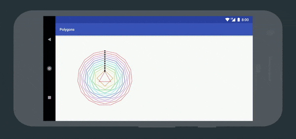

# Kyrie

[![Build status][travis-badge]][travis-badge-url]
[](https://bintray.com/alexjlockwood/maven/kyrie/_latestVersion)

Kyrie is a superset of Android's `VectorDrawable` and `AnimatedVectorDrawable` classes: it can do everything they can do and more.



## Motivation

`VectorDrawable`s are great because they provide density independence—they can be scaled arbitrarily on any device without loss of quality. `AnimatedVectorDrawable`s make them even more awesome, allowing us to animate specific properties of a `VectorDrawable` in a variety of ways.

However, these two classes also have some limitations:

- They can't be paused, resumed, or seeked.
- They can't be dynamically created at runtime (they must be inflated from a drawable resource).
- They only support a small subset of features that SVGs provide on the web.

Kyrie was created in order to address these problems.

## Getting started

To create an animation using Kyrie, we first need to build a [`KyrieDrawable`][kyriedrawable]. There are two ways to do this:

### Option #1: from an existing VD/AVD resource

With Kyrie, we can convert an existing VD/AVD resource into a `KyrieDrawable` with a single line:

```java
KyrieDrawable drawable = KyrieDrawable.create(context, R.drawable.my_vd_or_avd);
```

Once we do this, we can perform several actions that are currently not possible using `AnimatedVectorDrawable`s, such as:

1. Seek the animation using [`setCurrentPlayTime(long)`][kyriedrawable#setcurrentplaytime].
2. Pause and resume the animation using [`pause()`][kyriedrawable#pause] and [`resume()`][kyriedrawable#resume].
3. Listen for animation events using [`addListener(KyrieDrawable.Listener)`][kyriedrawable#addlistener].

### Option #2: programatically using a [`KyrieDrawable.Builder`][kyriedrawable#builder]

We can also build `KyrieDrawable`s at runtime using the builder pattern. `KyrieDrawable`s are similar to SVGs and `VectorDrawable`s in that they are tree-like structures built of [`Node`][node]s. As we build the tree, we can optionally assign [`Animation`][animation]s to the properties of each `Node` to create a more elaborate animation.

Here is a snippet of code from the [sample app][progressfragment] that shows how we can programatically create a circular progress indicator:

Here is a snippet of code from the [sample app][progressfragment] that shows how we can programatically create a circular progress indicator:

```java
KyrieDrawable drawable =
    KyrieDrawable.builder()
        .viewport(48f, 48f)
        .tint(Color.RED)
        .child(
            GroupNode.builder()
                .translateX(24f)
                .translateY(24f)
                .rotation(
                    Animation.ofFloat(0f, 720f)
                        .duration(4444)
                        .repeatCount(Animation.INFINITE))
                .child(
                    PathNode.builder()
                        .strokeColor(Color.WHITE)
                        .strokeWidth(4f)
                        .trimPathStart(
                            Animation.ofFloat(0f, 0.75f)
                                .duration(1333)
                                .repeatCount(Animation.INFINITE)
                                .interpolator(
                                    PathInterpolatorCompat.create(
                                        PathData.toPath("M0 0h.5C.7 0 .6 1 1 1"))))
                        .trimPathEnd(
                            Animation.ofFloat(0.03f, 0.78f)
                                .duration(1333)
                                .repeatCount(Animation.INFINITE)
                                .interpolator(
                                    PathInterpolatorCompat.create(
                                        PathData.toPath(
                                            "M0 0c.2 0 .1 1 .5.96C.966.96.993 1 1 1"))))
                        .trimPathOffset(
                            Animation.ofFloat(0f, 0.25f)
                                .duration(1333)
                                .repeatCount(Animation.INFINITE))
                        .strokeLineCap(StrokeLineCap.SQUARE)
                        .pathData("M0-18a18 18 0 1 1 0 36 18 18 0 1 1 0-36")))
        .build();
```

Or more succinctly in Kotlin:

```kotlin
val drawable =
    kyrieDrawable {
        viewport = size(48f, 48f)
        tint = Color.RED
        group {
            translateX(24f)
            translateY(24f)
            rotation(
                Animation.ofFloat(0f, 720f)
                    .duration(4444)
                    .repeatCount(Animation.INFINITE)
            )
            path {
                strokeColor(Color.WHITE)
                strokeWidth(4f)
                trimPathStart(
                    Animation.ofFloat(0f, 0.75f)
                        .duration(1333)
                        .repeatCount(Animation.INFINITE)
                        .interpolator("M0 0h.5C.7 0 .6 1 1 1".asPathInterpolator())
                )
                trimPathEnd(
                    Animation.ofFloat(0.03f, 0.78f)
                        .duration(1333)
                        .repeatCount(Animation.INFINITE)
                        .interpolator("M0 0c.2 0 .1 1 .5.96C.966.96.993 1 1 1".asPathInterpolator())
                )
                trimPathOffset(
                    Animation.ofFloat(0f, 0.25f)
                        .duration(1333)
                        .repeatCount(Animation.INFINITE)
                )
                strokeLineCap(StrokeLineCap.SQUARE)
                pathData("M0-18a18 18 0 1 1 0 36 18 18 0 1 1 0-36")
            }
        }
    }
```

## Further reading

- Check out [this blog post][adp-blog-post] for more on the motivation behind the library.
- Check out [the sample app][sample-app-source-code] for example usages in both Java and Kotlin.
- Check out [the documentation][documentation] for a complete listing of all supported `Animation`s and `Node`s that can be used when constructing `KyrieDrawable`s programatically.

## Dependency

Add this to your root `build.gradle` file (_not_ your module's `build.gradle` file):

```gradle
allprojects {
    repositories {
        // ...
        jcenter()
    }
}
```

Then add the library to your module's `build.gradle` file:

```gradle
dependencies {
    // ...
    implementation 'com.github.alexjlockwood:kyrie:0.1.5'
}
```

## Compatibility

- **Minimum Android SDK**: Kyrie requires a minimum API level of 14.
- **Compile Android SDK**: Kyrie requires you to compile against API 28 or later.

[travis-badge]: https://travis-ci.org/alexjlockwood/kyrie.svg?branch=master
[travis-badge-url]: https://travis-ci.org/alexjlockwood/kyrie
[kyriedrawable]:https://alexjlockwood.github.io/kyrie/com.github.alexjlockwood.kyrie/-kyrie-drawable/index.html
[node]: https://alexjlockwood.github.io/kyrie/com.github.alexjlockwood.kyrie/-node/index.html
[animation]: https://alexjlockwood.github.io/kyrie/com.github.alexjlockwood.kyrie/-animation/index.html
[progressfragment]: https://github.com/alexjlockwood/kyrie/blob/master/sample/src/main/java/com/example/kyrie/ProgressFragment.kt
[kyriedrawable#setcurrentplaytime]: https://alexjlockwood.github.io/kyrie/com.github.alexjlockwood.kyrie/-kyrie-drawable/current-play-time.html
[kyriedrawable#pause]: https://alexjlockwood.github.io/kyrie/com.github.alexjlockwood.kyrie/-kyrie-drawable/pause.html
[kyriedrawable#resume]: https://alexjlockwood.github.io/kyrie/com.github.alexjlockwood.kyrie/-kyrie-drawable/resume.html
[kyriedrawable#addlistener]: https://alexjlockwood.github.io/kyrie/com.github.alexjlockwood.kyrie/-kyrie-drawable/add-listener.html
[kyriedrawable#builder]: https://alexjlockwood.github.io/kyrie/com.github.alexjlockwood.kyrie/-kyrie-drawable/-builder/index.html
[documentation]: https://alexjlockwood.github.io/kyrie/com.github.alexjlockwood.kyrie/index.html
[sample-app-source-code]: https://github.com/alexjlockwood/kyrie/tree/master/sample/src/main/java/com/example/kyrie
[adp-blog-post]: https://www.androiddesignpatterns.com/2018/03/introducing-kyrie-animated-vector-drawables.html
